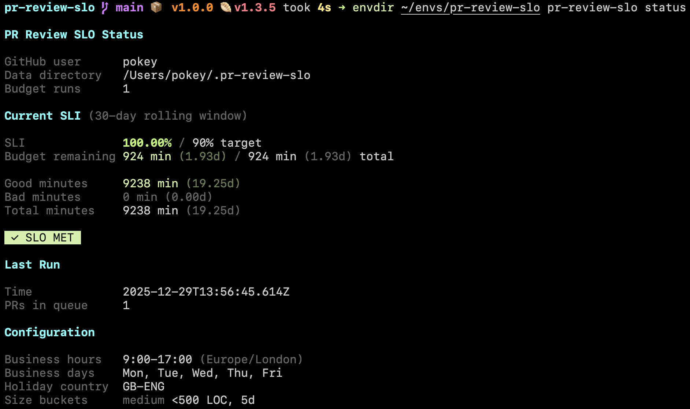

# pr-review-slo

CLI tool for tracking personal PR review responsiveness as an SLO (Service Level Objective).



**SLO Definition:** Over any rolling 30-day window, at least 90% of business minutes have zero overdue PR review requests assigned to me.

## Installation

```bash
bun install
```

## Setup

1. Create a GitHub personal access token at https://github.com/settings/tokens with `repo` scope (or `public_repo` for public repos only).

2. Initialize the tool with your GitHub username:

```bash
bun run src/cli.ts init <your-github-username>
```

3. Set your GitHub token:

```bash
export GITHUB_TOKEN=ghp_xxxxxxxxxxxx
```

## Usage

### Log Review Requests

Log your current PR review requests to file:

```bash
bun run src/cli.ts log-review-requests
```

### Get Review Recommendations

See which PRs you must review today vs. extra credit:

```bash
bun run src/cli.ts get-prs-to-review
```

### Manage PTO

Add PTO intervals (excluded from business minutes):

```bash
bun run src/cli.ts add-pto --from=2025-12-24 --to=2025-12-31
bun run src/cli.ts list-pto
```

### Check Status

View current SLI and configuration:

```bash
bun run src/cli.ts status
```

## How It Works

### Size Buckets & Deadlines

| Size   | LOC   | Deadline          |
| ------ | ----- | ----------------- |
| Small  | < 200 | 1 business day    |
| Medium | < 800 | 3 business days   |
| Large  | ≥ 800 | Excluded from SLO |

### Business Time

- Business hours: 09:00-17:00 (configurable)
- Business days: Mon-Fri
- Excludes public holidays (fetched from Nager.Date API)
- Excludes PTO intervals

### Error Budget

With a 90% SLO target over 30 days:

- ~10% of business minutes can be "bad" (have overdue PRs)
- The tool tracks bad minutes and warns when budget is running low

## Configuration

Config is stored at `~/.pr-review-slo/config.toml`. Edit to customize:

```toml
[github]
username = "yourname"
# repos = ["org/repo"]  # Optional: filter to specific repos

[businessHours]
start = 9
end = 17
timezone = "America/Los_Angeles"

businessDays = [1, 2, 3, 4, 5]  # Mon-Fri
holidayCountryCode = "US"

[slo]
target = 0.90
windowDays = 30

[sizeBuckets.small]
maxLoc = 200
businessDays = 1

[sizeBuckets.medium]
maxLoc = 800
businessDays = 3
```

## Data Storage

All data is stored in `~/.pr-review-slo/`:

- `config.toml` - Configuration
- `budget-runs.jsonl` - Historical budget run records
- `pto.jsonl` - PTO intervals
- `holidays-{year}.json` - Cached holiday data

## Scheduling Daily Runs (macOS)

Use launchd to run the SLO check automatically every day. Create a plist file at `~/Library/LaunchAgents/com.yourname.pr-review-slo.plist`:

```xml
<?xml version="1.0" encoding="UTF-8"?>
<!DOCTYPE plist PUBLIC "-//Apple//DTD PLIST 1.0//EN" "http://www.apple.com/DTDs/PropertyList-1.0.dtd">
<plist version="1.0">
<dict>
    <key>Label</key>
    <string>com.yourname.pr-review-slo</string>
    <key>ProgramArguments</key>
    <array>
        <string>/bin/bash</string>
        <string>-c</string>
        <string>GITHUB_TOKEN=ghp_xxx /path/to/bun /path/to/pr-review-slo log-review-requests</string>
    </array>
    <key>StartCalendarInterval</key>
    <dict>
        <key>Hour</key>
        <integer>12</integer>
        <key>Minute</key>
        <integer>0</integer>
    </dict>
    <key>StandardOutPath</key>
    <string>/tmp/pr-review-slo.log</string>
    <key>StandardErrorPath</key>
    <string>/tmp/pr-review-slo.err</string>
</dict>
</plist>
```

Then load it:

```bash
launchctl load ~/Library/LaunchAgents/com.yourname.pr-review-slo.plist
```

To test immediately:

```bash
launchctl start com.yourname.pr-review-slo
```

Unlike cron, launchd will run missed jobs when your Mac wakes from sleep.

## Testing

```bash
bun test
```
